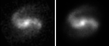
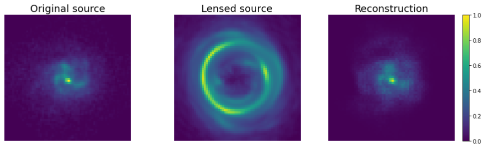

# Lensed source modelling with deep neural networks

The trend on all-sky surveys will provide the scientific community with thousands of objects, though it makes scientists look for ways of carrying out and validating the analysis of the images obtained with these wide-field surveys. One of the problems is that the current typical representation of a galaxy relies on a simple parametric fit profile like Sersic or some functional decompositions like wavelets/shapelets/starlets. These approaches have their downsides, for example, simplicity and high degeneracy of Sersic profile or the necessity to calculate high order (~20) decompositions to get complete reconstruction of the galaxy with shapelets. These downsides may result in a tradeoff between fitting quality and fitting time.

Luckily, machine learning provides a solution to both problems. In this work, we present a galaxy image reconstruction approach, which is based on Deep Neural Network called Variational autoencoder. This network can encode a galaxy image in a set of 64 parameters and decode the image back from this representation with minor structural losses, therefore solving the problem of usual parametric fits simplicity. The decoder of the VAE can be used as a model of galaxy image, allowing fitting images with usual fitting algorithms like LMA or MCMC, but with quite high speed. As an example fitting a 64x64 galaxy with BFGS took ~7 sec.

<figure>
  <figtitle>Original image and decoder fit result</figtitle>
  
</figure>

Furthermore, using the differentiable programming framework JAX, the VAE could be included in a larger modeling pipeline that is used in studies of gravitational lensing. In these terms the better is understanding of the source, the higher is the amount of information about the lens, that we can extract. Therefore the ability of VAE to provide one with high-quality reconstructions of sources facilitates fitting and studying gravitational lenses.

